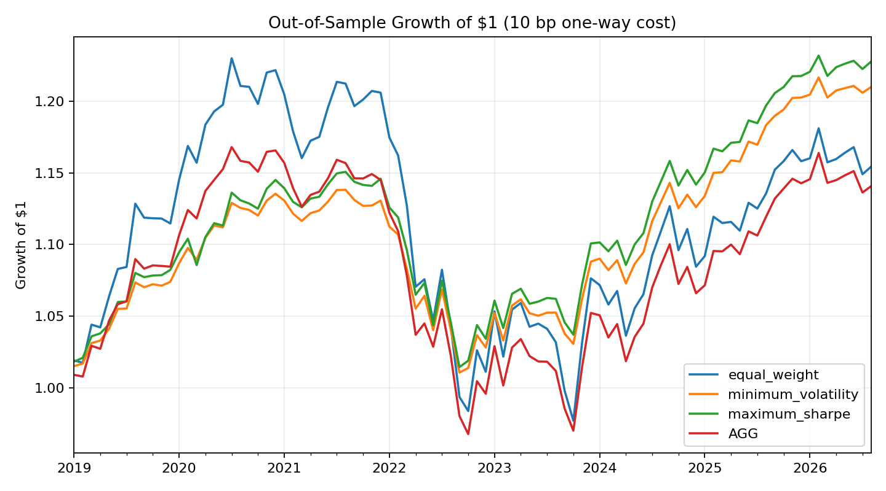

# Historical Fixed-Income Portfolio Optimization and Risk Analytics

This project tests whether constrained bond-ETF allocations trained on historical data improve out-of-sample risk-adjusted and benchmark-relative results. It combines total-return portfolio analysis, rate and spread-duration scenarios, credit-spread context, liquidity proxies, and transaction-cost sensitivity in one reproducible Python workflow.

## Verified result snapshot

The universe contains five investable U.S.-listed bond ETFs: SHY, IEF, TLT, LQD and HYG. AGG is the broad U.S. bond benchmark. The optimizer used 107 monthly observations from February 2010 through December 2018 and reserved 92 months from January 2019 through August 2026 as an untouched test period.

At a 10 bp one-way trading-cost assumption:

| Portfolio | CAGR | Volatility | Max drawdown | Tracking error vs AGG | Information ratio |
|---|---:|---:|---:|---:|---:|
| Minimum volatility | 2.52% | 4.05% | -11.20% | 2.11% | 0.33 |
| Maximum Sharpe | 2.71% | 4.37% | -11.83% | 2.12% | 0.42 |

These are historical research results, not forecasts. The zero-risk-free-rate Sharpe calculation is reported only for a consistent comparison across portfolios.



## What the project adds

- Historical adjusted-price returns instead of assumed return and covariance inputs
- Long-only optimization with a 45% per-sleeve concentration cap
- Fixed training and untouched test periods to reduce look-ahead bias
- AGG-relative active return, tracking error and information ratio
- Parallel, steepening and credit-widening scenarios using disclosed rate, key-rate and spread-duration inputs
- FRED investment-grade and high-yield option-adjusted spread context
- Median and fifth-percentile daily dollar-volume proxies
- Monthly rebalancing under 0, 5 and 10 bp one-way cost assumptions
- Unit tests for weight constraints, transaction costs and benchmark calculations

## Portfolio construction

| Symbol | Sleeve | Primary role |
|---|---|---|
| SHY | 1-3 Year Treasuries | Short-duration defense |
| IEF | 7-10 Year Treasuries | Intermediate rate exposure |
| TLT | 20+ Year Treasuries | Long-duration exposure |
| LQD | Investment-grade corporate bonds | High-quality credit exposure |
| HYG | High-yield corporate bonds | Higher-spread credit exposure |
| AGG | Broad U.S. investment-grade bonds | Benchmark only |

## Reproduce

```bash
python -m venv .venv
# Windows PowerShell: .\.venv\Scripts\Activate.ps1
pip install -r requirements.txt
python src/analyze.py
pytest -q
```

The analysis stops at August 2026 to avoid using an incomplete September monthly return. Downloaded raw data are excluded from version control; the script recreates them.

## Repository map

- `src/analyze.py` - data retrieval, validation, optimization, risk analytics and exports
- `tests/test_analysis.py` - unit tests
- `outputs/portfolio_weights.csv` - trained portfolio allocations
- `outputs/out_of_sample_metrics.csv` - performance and benchmark-relative results
- `outputs/duration_scenario_impacts.csv` - rate and spread shock estimates
- `outputs/liquidity_proxies.csv` - daily dollar-volume summaries
- `outputs/credit_spread_summary.csv` - FRED OAS context
- `METHODOLOGY.md` - definitions, assumptions and limitations

## Interpretation

The maximum-Sharpe portfolio produced the highest test-period active return and information ratio, while the minimum-volatility portfolio had the lowest volatility and drawdown. Both allocations were concentrated in short Treasuries and high yield under the 45% cap. That concentration is a model-risk warning: the results depend on the selected training period, asset proxies and objective, and should not be interpreted as a recommended live portfolio.

## Data sources

- Yahoo Finance chart data for adjusted ETF prices and trading volume
- Federal Reserve Economic Data (FRED): ICE BofA U.S. Corporate Index OAS (`BAMLC0A0CM`) and U.S. High Yield Index OAS (`BAMLH0A0HYM2`)

See `METHODOLOGY.md` for exact definitions and limitations.

